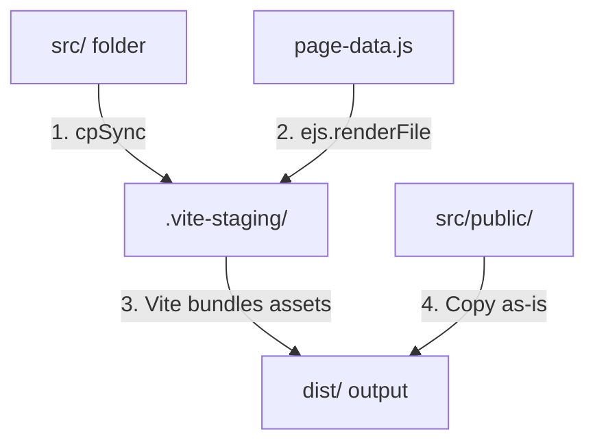

# BUILD — Posh Limousines of Atlanta

> Marketing and booking site for Posh Limousines of Atlanta — a black-SUV chauffeur service. Built as a Vite-based static site generator (SSG) with EJS pre-rendering, a live Google Maps-powered fare estimator, and Netlify Functions for server-side pricing logic.

---

## Prerequisites

- Node.js v20+
- npm v9+
- A Netlify account (for deployment) with the site's `netlify/functions` runtime enabled
- A Google Maps Platform API key with the **Routes API**, **Directions API**, and **Places API (New)** enabled (see [Environment variables](#environment-variables))

---

## Quick start

```bash
git clone <repo-url>
cd "PoshLimos Project"
npm install
```

Create a `.env` file in the project root (no `.env.example` currently ships with the repo):

```
GOOGLE_MAPS_API_KEY=your_key_here
```

```bash
npm run dev
```

Open: http://localhost:5173

> Without `GOOGLE_MAPS_API_KEY` set, the fare calculator function (`netlify/functions/calculate-fare.mjs`) falls back to fixed mock route legs (~12.5 mi / 22 min) instead of calling Google — useful for local UI work without burning API quota, but fares will not reflect real distances.

---

## npm scripts

| Script | What it does |
|--------|--------------|
| `npm run dev` | Starts the Vite dev server with HMR at `localhost:5173`, including the EJS pre-render middleware and an inline handler for the fare-calculator Netlify function. |
| `npm run build` | Pre-renders all EJS pages into `.vite-staging/`, then has Vite bundle/minify JS & CSS and hash/optimize images into `dist/`. |
| `npm run preview` | Serves the built `dist/` output locally, matching production behavior (routing, headers). |
| `npm run render` | Runs `scripts/render-ejs.js` directly — regenerates `.vite-staging/` from `src/` + `page-data.js` without a full Vite build. Useful for quickly inspecting rendered HTML output. |

---

## Project structure

```
PoshLimos-Project/
├── dist/                     # Production output (deployed to Netlify)
├── .vite-staging/            # Temp directory used for EJS pre-rendering (gitignored, regenerated per build)
├── src/                      # Source files — Vite's configured root
│   ├── assets/                 # Images (processed & hashed by Vite)
│   ├── partials/                # Reusable EJS layout blocks
│   │   ├── layout_start.html      # <head>: meta/SEO tags, GA tag, JSON-LD, CSS link, Calendly widget CSS
│   │   ├── nav.html               # Global header + desktop/mobile nav
│   │   ├── footer.html            # Footer content & social links
│   │   └── layout_end.html        # Closing markup + <script src="/script.js">
│   ├── public/                  # Static passthrough assets (sitemap.xml, robots.txt) → copied to dist/ root as-is
│   ├── script.js                 # Single client-side JS entry point (see JavaScript architecture)
│   ├── style.css                 # Single stylesheet entry point
│   └── *.html                    # Page entry points — EJS templates with an .html extension (see Pages)
├── netlify/
│   └── functions/
│       └── calculate-fare.mjs   # Serverless fare-pricing endpoint (see Fare calculator)
├── scripts/
│   └── render-ejs.js            # EJS pre-render logic shared by Vite plugin and `npm run render`
├── page-data.js               # Per-page metadata (title, SEO, JSON-LD schema) keyed by page name, fed into EJS
├── extract-text.js            # Standalone dev utility — pulls visible text out of dist/**/*.html for content review (not part of the build pipeline)
├── vite.config.js             # Vite config, staging plugin, dev middleware for the fare function
├── netlify.toml                # Netlify build settings, clean-URL redirects, security headers
└── package.json                # Scripts & dependencies
```

---

## Pages

All pages live in `src/*.html`, are registered in `PAGES` in [scripts/render-ejs.js](scripts/render-ejs.js), and have a matching metadata entry in [page-data.js](page-data.js). Adding a page requires touching both.

| Page | File | Purpose |
|------|------|---------|
| Home | `index.html` | Landing page, hero, service overview |
| Airport Transfers | `airport-transfers.html` | ATL arrivals/departures service page |
| Casual Events | `casual-events.html` | Concerts, sporting events, nights out |
| Corporate Events | `corporate-events.html` | Executive/business transportation |
| Formal Celebrations | `formal-celebrations.html` | Weddings, proms, anniversaries |
| Safe Driver Pickup | `safe-driver-pickup.html` | Designated-driver & long-distance service |
| Signature Accounts | `signature-accounts.html` | Recurring-client account program |
| Posh Preferred | `posh-preferred.html` | Referral rewards program |
| Rates | `rates.html` | Live fare estimator (Places Autocomplete + `calculate-fare` function) |
| About | `about.html` | Company standard, vetting, coverage area |
| Privacy Policy | `privacy-policy.html` | Legal |
| Terms of Service | `tos.html` | Legal |

---

## JavaScript architecture

The site has a single bundled client entry point, [src/script.js](src/script.js), loaded as an ES module from `layout_end.html`. It is organized into self-contained sections, each guarded by an element-existence check so it's a no-op on pages that don't have that markup:

1. **Theme toggle** — light/dark mode, persisted to `localStorage`.
2. **Mobile menu toggle** — hamburger nav with scroll locking.
3. **Services dropdown** — click/keyboard-accessible nav dropdown, closes on outside click or `Escape`.
4. **Scroll reveal** — `IntersectionObserver`-driven `.reveal` animations, with a no-JS/no-Observer fallback that shows everything immediately.
5. **FAQ accordion** — single-open-at-a-time accordion driven by `aria-expanded`.
6. **Web3Forms contact submission** — AJAX POST to `api.web3forms.com` with loading/success/error UI states.
7. **`openCalendly(type)`** — opens the Calendly popup widget for a given service type. Explicitly assigned to `window.openCalendly` because inline `onclick="openCalendly(...)"` handlers need it in global scope, which ES modules don't provide by default.

The fare estimator on `rates.html` has its own inline `<script>` block (not in `script.js`) that drives Places Autocomplete, calls the `calculate-fare` Netlify function, and renders results — see [Fare calculator](#fare-calculator-netlify-function).

---

## CSS architecture

Single stylesheet, [src/style.css](src/style.css), linked from `layout_start.html`. Imports Google Fonts (Outfit, Playfair Display) and defines the light/dark theme via `.light-theme` class toggling (default is dark).

---

## Environment variables

| Variable | Used for | Required? |
|----------|----------|-----------|
| `GOOGLE_MAPS_API_KEY` | Server-side: passed to Google's Routes API / Directions API from `calculate-fare.mjs`. Client-side: injected into `rates.html`'s Maps JavaScript API loader `<script>` tag by `page-data.js`/`vite.config.js` for Places Autocomplete. | Yes for real fare data — without it, routing falls back to mock legs and Places Autocomplete on `rates.html` won't load. |

Set locally in `.env` (gitignored) and in the Netlify dashboard's environment variables for production/deploy previews. There is no `.env.example` in the repo currently.

---

## Third-party services

| Service | Where | Notes |
|---|---|---|
| **Google Maps Platform** | `calculate-fare.mjs`, `rates.html` | Routes API (primary) + Directions API legacy (fallback) for server-side routing; Maps JavaScript API + Places API (New) for client-side address autocomplete. See [Fare calculator](#fare-calculator-netlify-function). |
| **Calendly** | `layout_start.html`, `script.js` | Booking popup widget, opened per-service via `openCalendly(type)`. |
| **Web3Forms** | `script.js` | Contact form submission endpoint (`api.web3forms.com`) — no backend form handler needed. |
| **Google Analytics (gtag.js)** | `layout_start.html` | Page tracking, measurement ID `G-SFV7EXN54K`. |

All external origins these rely on are allow-listed in `netlify.toml`'s `Content-Security-Policy` header — adding a new third-party script requires updating that CSP too.

---

## Fare calculator (Netlify function)

[netlify/functions/calculate-fare.mjs](netlify/functions/calculate-fare.mjs) is the pricing engine behind `rates.html`. Request flow:

1. `rates.html` collects pickup/dropoff/stop addresses via Places Autocomplete (`PlaceAutocompleteElement`) and POSTs them to `/.netlify/functions/calculate-fare` (proxied by a dev-only Vite middleware in `vite.config.js` so it works under `npm run dev` without the Netlify CLI).
2. The function calls Google's **Routes API** for the optimized multi-stop route, falling back to the legacy **Directions API** if that call errors. If no API key is configured, it returns fixed mock legs instead (dev/testing only).
3. Pricing rules applied on top of the returned distance/duration:
   - Base fare, per-mile rate, per-stop fee (first stop ≤2 mi is free), late-night fee (before 6am), time-banded HOT-lane surcharge, optional Meet & Greet fee.
4. Returns line items plus a low/high estimate range, which `rates.html` renders.

A legacy request shape (`miles`, `tripDurationMins`, `paidStops`, `stopMiles` sent directly instead of addresses) is still supported for backward compatibility, bypassing the Google API calls entirely.

---

## How the EJS + Vite SSG integration works

Vite parses standard HTML for assets/stylesheets/module scripts, but EJS syntax (`<%- include %>`, `<%= locals %>`) isn't standard HTML — Vite can't parse it directly. The custom plugin in [vite.config.js](vite.config.js) bridges this with a staging strategy:



1. **Staging**: at the start of a build or dev request, `src/` is copied into `.vite-staging/`.
2. **Pre-rendering**: the plugin loops through `PAGES` and uses EJS to render each page in `.vite-staging/` using metadata from `page-data.js`, overwriting the raw templates with compiled HTML.
3. **Bundling**: Vite targets `.vite-staging/` as its project root, parses the compiled HTML, resolves script/style linkages, optimizes assets, and outputs to `dist/`.

### Infinite HMR loop prevention (dev mode)

Because Vite's dev server root is `.vite-staging/`, writes to that folder normally trigger the filesystem watcher. The dev middleware re-renders on every HTML page request, which would otherwise create a Request → Render → Watcher Trigger → Reload loop. `vite.config.js` breaks this by ignoring `.html` files in the staging directory:

```javascript
server: {
  watch: {
    ignored: [`${STAGE}/**/*.html`],
  },
}
```

HMR stays active for CSS/JS; HTML changes are picked up on next navigation/refresh instead.

### Static asset handling (SEO)

Pure static assets that must sit at the deployed site's root (`sitemap.xml`, `robots.txt`) live in `src/public/`. Since that folder is copied into `.vite-staging/public/`, Vite treats it as its static assets directory and copies its contents untouched into `dist/`.

---

## Deployment

Deployed to Netlify via git push. Configuration is in [netlify.toml](netlify.toml):

- **Build command**: `npm run build`
- **Publish directory**: `dist`
- **Functions directory**: `netlify/functions`
- **Clean URLs**: redirects strip `.html` from extensionless paths (e.g. `/airport-transfers` → `/airport-transfers.html`) with transparent `200` status codes.
- **Security headers**: CSP, `X-Frame-Options`, `X-Content-Type-Options`, `Referrer-Policy`, `Permissions-Policy` applied to all routes.
- **Caching**: hashed assets under `/assets/*` get a 1-year immutable cache; HTML pages revalidate on every request.

---

## Schema.org structured data

Every page carries a global `LocalBusiness` JSON-LD block (in `layout_start.html`) plus a page-specific `pageSchema` block defined per-page in `page-data.js` (typically `Service` + `BreadcrumbList` + `FAQPage`). Use the `jsonld-schema` skill to add or update schema blocks.

---

## Common tasks

**Add a new page**
1. Create `src/<name>.html` with the standard `layout_start` / `nav` / ... / `footer` / `layout_end` include structure.
2. Add `"<name>"` to `PAGES` in `scripts/render-ejs.js`.
3. Add a matching entry to `page-data.js` (title, description, canonical, schema, etc.).
4. If it needs a clean URL redirect, add a `[[redirects]]` block in `netlify.toml`.

**Add a JS behavior**
- Add a new guarded section to `src/script.js` following the existing pattern (element-existence check, self-contained block). Only `rates.html`'s calculator logic lives outside this file, as an inline script.

**Update styles**
- Edit `src/style.css` directly; there's no preprocessor or CSS module system.

**Update env vars**
- Add to `.env` locally and to the Netlify dashboard for deploys. Remember `GOOGLE_MAPS_API_KEY` is consumed both server-side (function) and client-side (injected into rendered HTML) — see [Environment variables](#environment-variables).

**Change fare pricing**
- Edit the constants and rate logic at the top of `netlify/functions/calculate-fare.mjs` (`BASE`, `RATE`, `STOP_FEE`, `LATE_FEE`, `MEET_GREET`, `FREE_STOP_MI`, and the `hotLaneRate()` time windows).

---

## Notes

- `calculator.html`, a standalone legacy fare-calculator demo at the project root using an unset placeholder API key and the legacy Places/Distance Matrix APIs, has been removed — it was never part of the build (`PAGES` list) and was superseded by `rates.html` + `calculate-fare.mjs`.
- `extract-text.js` at the project root is a standalone content-review utility (extracts visible text from `dist/**/*.html`) — not wired into `npm run` scripts, run manually as needed.
- The previously-noted legacy `views/`, root-level `public/`, and `build.js` artifacts from a pre-Vite build process no longer exist in the repo.
