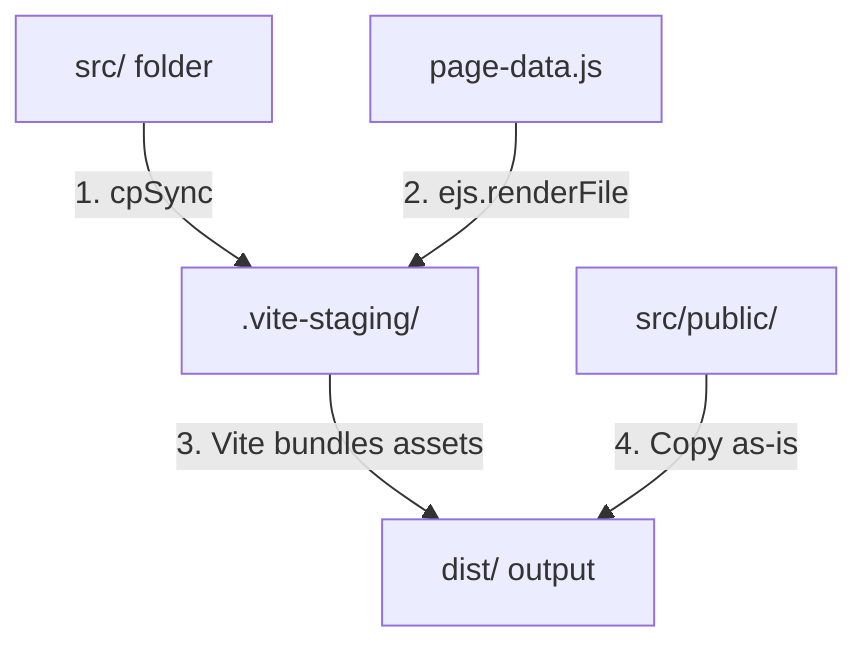

# Posh Limousines of Atlanta — Vite SSG Build & Architecture Guide

This project has been migrated to a modern **Vite-based Static Site Generation (SSG)** pipeline. This document outlines the folder structure, build commands, pre-rendering architecture, and deployment configurations.

---

## 📂 Directory Architecture

```
PoshLimos-Project/
├── dist/                     # Production output (deployed to Netlify)
├── src/                      # Source files (Vite root staged files copy here)
│   ├── assets/               # Local images (processed and hashed by Vite)
│   ├── partials/             # Reusable EJS HTML layout blocks
│   │   ├── layout_start.html # Head meta, SEO tags, CSS links
│   │   ├── nav.html          # Global header and desktop/mobile navigation
│   │   ├── footer.html       # Footer details & social media links
│   │   └── layout_end.html   # Main script references, close body/html
│   ├── public/               # Pure static assets (sitemap.xml, robots.txt)
│   ├── script.js             # Client-side JavaScript (bundled & optimized)
│   ├── style.css             # Main stylesheet (compiled & minified)
│   └── *.html                # Page entry points (EJS templates with HTML ext)
├── .vite-staging/            # Temporary directory used for EJS pre-rendering
├── page-data.js              # Per-page metadata (injected into EJS templates)
├── vite.config.js            # Vite configurations and custom pre-render plugin
├── netlify.toml              # Netlify hosting and clean URL redirects
└── package.json              # Scripts & dependencies
```

> [!NOTE]
> **Legacy Files**: The root directories/files `views/`, `public/` (root-level), and `build.js` are artifacts of the previous Node-based generation process. They are no longer used by the Vite build pipeline and can be safely ignored or deleted.

---

## 🚀 Development & Build Commands

All commands are managed through standard `npm` scripts:

### 1. Start Development Server
```bash
npm run dev
```
Starts Vite's dev server at `http://localhost:5173`. 
* **Dynamic Re-rendering**: The custom dev middleware intercept requests. If you edit any EJS template or data in `page-data.js` and refresh, it triggers an instant pre-render updates on `.vite-staging/` files and hot-reloads them.

### 2. Generate Production Build
```bash
npm run build
```
Pre-renders all EJS pages into clean HTML in the `.vite-staging/` directory, bundles and minifies CSS/JS assets, hashes images for cache busting, and outputs the production bundle to `dist/`.

### 3. Preview Production Build
```bash
npm run preview
```
Spins up a local server to preview the built site exactly as it will behave in production (useful for testing redirects and routing).

---

## ⚙️ How the EJS + Vite SSG Integration Works

Vite requires standard HTML files to parse assets, stylesheets, and module scripts. Because EJS syntax (`<%- include %>`, `<%= locals %>`) is not standard HTML, Vite cannot parse it directly. 

To bridge this, the custom plugin inside [vite.config.js](file:///c:/Users/rwalk/Documents/JavaScript/Node/PoshLimos%20Project/vite.config.js) implements a **staging strategy**:



1. **Staging**: At the start of a build or dev request, the entire `src/` directory is copied into `.vite-staging/`.
2. **Pre-rendering**: The plugin loops through the registered `PAGES` list and uses EJS to render each page in `.vite-staging/` using the metadata provided in [page-data.js](file:///c:/Users/rwalk/Documents/JavaScript/Node/PoshLimos%20Project/page-data.js). The raw templates are overwritten with fully compiled HTML.
3. **Bundling**: Vite targets `.vite-staging/` as its project root. It parses the compiled HTML files, resolves all script/style linkages, optimizes assets, and outputs the clean result to `dist/`.

---

## 🛠️ Key Implementation Details

### JavaScript Modularity & Global Functions
Vite bundles scripts as **ES modules** (`type="module"`). In ES modules, variables and functions declared at the top-level are scoped to that file rather than the global `window` object. 

Because the HTML files use inline handlers like `onclick="openCalendly('home')"` to trigger popups, `openCalendly` must exist on `window`. In [script.js](file:///c:/Users/rwalk/Documents/JavaScript/Node/PoshLimos%20Project/src/script.js), we explicitly bind it:
```javascript
window.openCalendly = openCalendly;
```

### Static Asset Handling (SEO)
Pure static assets that must sit at the root of the deployed website (e.g. `sitemap.xml`, `robots.txt`) are stored in [src/public/](file:///c:/Users/rwalk/Documents/JavaScript/Node/PoshLimos%20Project/src/public/).
* Since `src/public/` is copied into `.vite-staging/public/`, Vite treats this folder as its static assets directory and transfers its contents directly to the root of `dist/` untouched.

### Infinite HMR Loop Prevention (Dev Mode)
Because Vite's development server root is set to the staging directory `.vite-staging/`, any writes to this folder normally trigger Vite's filesystem watcher. 

Under the dev server middleware, requesting any HTML page triggers `renderAll()`, which pre-renders and writes compiled HTML files into `.vite-staging/`. If the filesystem watcher triggers a reload upon seeing these HTML files write, it starts a recursive feedback loop (Request → Render → Watcher Trigger → Reload → Request).

To prevent this, the watch settings in [vite.config.js](file:///c:/Users/rwalk/Documents/JavaScript/Node/PoshLimos%20Project/vite.config.js) ignore `.html` files in the staging directory:
```javascript
server: {
  watch: {
    ignored: [`${STAGE}/**/*.html`],
  },
}
```
This breaks the infinite reload loop while keeping HMR active for CSS and JS assets, ensuring smooth local development.

---

## 🌐 Netlify Deployment

The hosting configuration is automated in [netlify.toml](file:///c:/Users/rwalk/Documents/JavaScript/Node/PoshLimos%20Project/netlify.toml):
* **Publish Directory**: `dist`
* **Build Command**: `npm run build`
* **Clean URLs**: Configured redirects automatically rewrite extensionless URLs (e.g. `/airport-pickups`) to their compiled HTML paths (`/airport-pickups.html`) with transparent `200` status codes.
* **Aggressive Caching**: Long-term immutable caching (`max-age=31536000`) is configured for Vite's hashed assets inside `/assets/*`, while HTML pages are set to revalidate on every request to ensure users always see the latest code.
